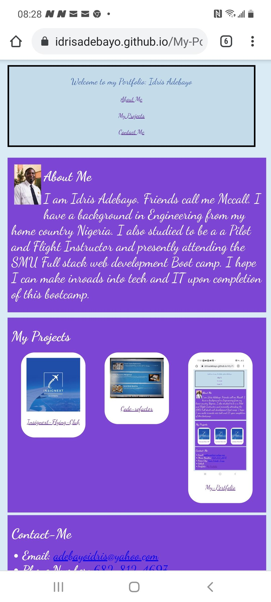

# My-Portfolio

## Table of Contents (Optional)

If your README is very long, add a table of contents to make it easy for users to find what they need.

* [Usage](#usage)
* [deployed link](#deployed link)
* [description](#description)
* [Credits](#credits)
* [License](#license)

## Usage 
image of finished project

## deployed link: https://idrisadebayo.github.io/My-Portfolio/

## description
This portfolio project is the first I will attempt to build from scratch
It feels fulfilling after only having atsrted three weeks earlier to be able to build a deployable responsive website that functions on bothe desktop and mobile devices

The links in the header section takes you to that section of the same page using th '#' in the links

This project helped me understand classes, IDs and styling references better

It was the first time I tried to use placeholder cards to create hyperlinks to navigate to to other webpages

## Credits
My most profound gratitude goes to Aiden Threadgoode for his assistance in helping take the first steps in this modest project.

I need to also gice credit to my class Instructor Jon Lynch and his assistants Andrew and Cody

I believe it is the first modest step to a wider world of possibilities in Software development

.